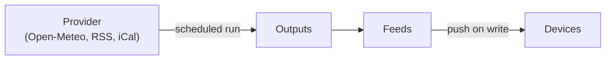

# Data sources

Alerts arrive because something else decided to send them. Dashboards are the
other direction: a widget on a screen needs a five-day forecast or a headline
list, and something has to go and fetch it on a schedule. That machinery is
what this page describes — how a widget says what it needs, how a provider
says what it can supply, and how the hub gets from one to the other without
either side knowing about the other.

## A widget asks, a provider offers

Nothing in the system hardcodes "the weather widget uses Open-Meteo". Two
declarations sit at opposite ends and never reference each other:

- **A widget declares what it consumes** — a contract, plus the capabilities
  it cannot render without and the ones it would use if offered.
- **A provider declares what it can produce** — for each contract it supports,
  the set of capabilities it can actually fill.

A widget asks in one of **two shapes**, depending on what kind of widget it is.
A *semantic* widget (weather, news, calendar) asks for a canonical payload
shape, and that is the contract-plus-capabilities pairing described here. An
*ordinary* widget — a gauge, a table, a chart — has no canonical shape to ask
for: it is parameterised by the path an operator binds, so what it declares is
a **type requirement at that path**. Both end up in the same `capabilities`
vocabulary, which is why one list can answer both; see [what a widget needs at
the path you bind](widgets.md#what-a-widget-needs-at-the-path-you-bind).

A provider can serve a widget when it supports the widget's contract and its
capability set covers everything the widget marks required. That single rule
is what the setup dialog filters on, so adding a provider makes it appear
wherever it qualifies, with no list to update anywhere.

Capabilities are why "supports weather" is not specific enough to be useful.
A provider that returns daily highs but no pollen count still satisfies a
forecast widget that only requires temperature — and the dialog will say, in
plain words, which optional details that particular source will leave blank.

??? note "Technical detail"
    Widget side: `hub/src/widgets/requirements.ts` (`WIDGET_REQUIREMENTS`),
    with `contract_id`, `required_capabilities`, `optional_capabilities`.
    Provider side: `potential_outputs` on each `ProviderDefinition` in
    `hub/src/sources/registry.ts`. `validateProviderDefinitions` refuses at
    boot any provider whose declared capabilities can't satisfy the contract
    it claims, so a malformed descriptor fails loudly rather than producing a
    source that never matches anything.

## Contracts

A contract is the shape of a payload and the mode it arrives in. Widgets and
providers both name one, which is what lets them be written independently.

| Contract | Mode | Collection limit |
| --- | --- | --- |
| `dashboardz.weather.current/v1` | value | — |
| `dashboardz.weather.daily-forecast/v1` | value | 7 |
| `dashboardz.news.items/v1` | stream | 100 |
| `dashboardz.calendar.events/v1` | value | 50 |
| `dashboardz.legacy.value/v1` | value | — |
| `dashboardz.legacy.stream/v1` | stream | — |
| `dashboardz.legacy.image/v1` | image | — |

**Mode** is how the data behaves, not what it means: a `value` is the current
truth and replaces what came before, a `stream` accumulates rows in order, an
`image` is bytes. The **collection limit** is enforced hub-side — a feed that
tries to carry more than the contract allows degrades deterministically rather
than growing without bound.

The `legacy.*` contracts exist so feeds that predate contracts keep working.
They carry no semantic guarantees, which is exactly why a widget written
against a real contract cannot accidentally bind to one.

A contract's payload is a fixed shape, not a bag the provider fills as it
likes. `dashboardz.weather.current/v1` is a single object:

```json
{
  "location": { "name": "Lisbon", "timezone": "Europe/Lisbon" },
  "observed_at": 1786622400000,
  "current": { "temp": 21.3, "condition": { "code": "cloudy", "label": "Cloudy" } },
  "attribution": { "label": "Weather data by Open-Meteo.com", "url": "https://open-meteo.com/" }
}
```

`temp` and `condition` are required; `feels_like`, `humidity`, `wind` and the
rest are the optional capabilities a widget may or may not get.
`dashboardz.news.items/v1` is a stream of rows instead, each carrying `id`,
`title`, and optionally `summary`, `url` and `published_at` — where `id` is
what deduplication rests on, so a provider that cannot produce a stable one
drops the row rather than re-appending it on every poll.

`dashboardz.calendar.events/v1` is a single object holding a list, capped at
fifty entries:

```json
{
  "events": [
    {
      "title": "Dentist",
      "start": "2026-08-07T09:00:00Z",
      "end": "2026-08-07T09:45:00Z",
      "all_day": false,
      "location": "Rua Garrett 12"
    },
    {
      "title": "Assunção de Nossa Senhora",
      "start": "2026-08-15",
      "end": "2026-08-16",
      "all_day": true,
      "location": null
    }
  ]
}
```

`all_day` decides how `start` and `end` are read, and validation enforces the
pairing: an all-day event carries plain `YYYY-MM-DD` dates, a timed one
carries ISO-8601 instants, and mixing them is a rejected payload rather than a
tolerated one. The flag is in the payload instead of inferred because a date
and a midnight instant are not the same claim — a renderer left to guess would
put the wrong heading on half a calendar.

Capability names are namespaced by contract (`weather.current`,
`news.item.title`), and a provider declaring one its contract does not define
is refused at boot.

The calendar vocabulary is `calendar.event.title`, `calendar.event.times`,
`calendar.event.all_day` and `calendar.event.location`. The first three are
declared unconditionally — including for a calendar with nothing in it. An
empty week is a legitimate thing for an agenda to draw, so making the
capabilities depend on content would leave a quiet calendar indistinguishable
from a source nothing can render. `calendar.event.location` is the one that
follows the data, and *any* event carrying a location is enough to declare it:
the rule weather uses for its optional fields — present on every entry —
would let a single location-less birthday drop the capability for the whole
calendar.

There is deliberately no `calendar.event.entries.N`. Weather has an
`entries.5` because a five-day widget genuinely cannot draw four days; a
calendar with nothing in it is just Tuesday.

The `calendar_events` widget requires `calendar.event.times` and
`calendar.event.title`, and treats `all_day` and `location` as optional. In
practice it always receives `all_day`, because a provider must declare that
capability to serve the contract at all — the two lists answer different
questions. A widget's required set is what it cannot draw without; a
contract's is what a provider must promise up front. `location` is on neither,
which is what keeps a calendar whose events have no locations a usable
calendar rather than an unmatched source.

## From a poll to a pixel



A **source** is a configured instance of a provider — "Lisbon, metric, every
900 seconds". The scheduler wakes it on its interval, the provider fetches and
normalizes, and the result is written as one or more **outputs**, each landing
in an ordinary feed. Devices are pushed to on write, so a later poll reaches
the glass without a reload.

Two behaviours are load-bearing and easy to break by accident:

- **A successful poll that finds nothing new still touches the feed.** Without
  it, a quiet news source trips the "feed has gone stale" alarm — the alarm
  reporting the source's own editorial calendar rather than a fault.
- **Backoff counts from the last attempt, not the last success.** A dead URL
  must not be retried every tick.

??? note "Technical detail"
    Scheduler: `hub/src/sources/loop.ts`; a run is `run.ts`, and
    `writeOutputs.ts` commits every output of a run in one transaction so a
    partially-written multi-output source cannot be observed. Providers take
    an injected fetch (`app.sourceFetch`), so no route or test can reach the
    network by accident and every provider test runs off fixtures.

## Drafts: real data before you commit

Setting up a source shows you real data before anything is saved. That is the
point of the draft: the hub performs the fetch, keeps the result in an
expiring draft, and renders it in the dialog, so the answer to "is this the
right feed?" is the actual content rather than a green tick.

A draft is deliberately short-lived and owned by the dialog that made it.
Abandon the setup and it is discarded; let it expire and the dialog says so
and offers to test again rather than promoting something stale. Nothing
becomes a real source until the screen is saved — the promotion happens
inside the screen-save transaction, so a screen and the sources it depends on
commit together or not at all.

**Any widget can be bound to a draft**, not only the semantic three. A cell
carrying `source_draft_id` + `output_contract` in place of `feed` is a screen
built against data that does not exist yet, and the save promotes the draft and
rewrites the cell to the real feed id before storing it. The promise is checked
first: an ordinary widget's needs are matched against what the draft's own
preview demonstrably carries, and a draft that cannot satisfy the cell is a 400
with nothing promoted. That is what removes "define the feed before you can
build the screen" — see [binding a source that does not exist
yet](screens.md#binding-a-source-that-does-not-exist-yet).

Secrets typed during setup are never echoed back. On re-edit, a secret field
stays blank and the stored value is retained unless a replacement is typed.

## Secrets and the master key

Provider credentials — an authenticated feed URL, an API token — are
encrypted at rest with a master key that is not in the database. Losing the
database loses the data; losing the key makes the stored secrets
unrecoverable, so a backup that captures only one of them is not a backup.

| Where the key comes from | Notes |
| --- | --- |
| `DASHBOARDZ_MASTER_KEY` | Base64, canonical form, decoding to exactly 32 bytes. Checked at boot. |
| `${DATA_DIR}/master.key` | Used when the variable is unset. Exactly 32 bytes, forced to `0600`. |

If neither is present and secrets already exist, the hub **refuses to start**
rather than generating a replacement key. Silently creating a new key would
turn every stored secret into undecryptable noise while looking like a clean
boot.

!!! warning "Back up both"
    A restore needs `hub.db` **and** the master key. Take them together.

## Built-in providers

Weather (Open-Meteo), news (RSS/Atom) and calendar (iCalendar) ship in the
box. Each declares its own setup fields, its interval floor, and the
capabilities it fills, so the setup form is generated from the provider rather
than written twice.

Interval floors are the provider's own rule, not a global default — a public
API that asks for 300 seconds between calls gets 300 seconds, and the form
says so in words when you try to go faster.

## Writing a provider

A provider is one module that declares what it is and how to run, and is
registered in `hub/src/sources/registry.ts`. There is no plugin loader and no
dynamic discovery — the built-in set is the set.

```ts
export const rssProvider = defineProvider({
  id: 'dashboardz.rss',
  package_id: 'dashboardz.builtin',
  package_version: '1.0.0',
  label: 'RSS',
  recommended: true,
  default_interval_s: 900,
  min_interval_s: 300,
  potential_outputs: [
    { contract_id: 'dashboardz.news.items/v1', capabilities: ['news.item.id', 'news.item.title'] },
  ],
  setup: [
    { name: 'url', label: 'Feed URL', type: 'url', required: true, secret: true },
    { name: 'max_items', label: 'Maximum items', type: 'number', required: true, secret: false, min: 1, max: 100 },
  ],
  validateSetup(config, secrets) { /* → { ok, config, secrets } or { ok: false, error } */ },
  async run(input, ctx) { /* → [{ contract_id, result }] */ },
})
```

Four rules the rest of the platform depends on:

- **`setup` is the whole form.** The admin generates its fields, its types and
  its interval floor from this descriptor. A field marked `secret: true` is
  write-only end to end — stored in the secret box, never returned by any API,
  rendered blank on re-edit.
- **`validateSetup` is the only place a config becomes canonical.** It runs on
  creation, on repair, and again before every scheduled run, so a config
  written by an older build is normalized rather than trusted.
- **`run` never reaches for `fetch`.** It uses `ctx.fetch`, which arrives from
  the injected `app.sourceFetch`. Every request goes through the shared
  provider boundary in `sources/errors.ts`: one deadline, one size cap, and
  HTTP failures translated into `SourceError` codes
  (`authentication_required`, `rate_limited`, `unreachable`,
  `invalid_response`) with provider-safe wording. An upstream body is never
  forwarded to a browser.
- **Output is validated before it is stored.** `validateProducedOutputs`
  checks a run's results against the contracts it claims, so a provider that
  drifts fails as `invalid_output` on its own connection rather than writing
  a shape a widget cannot render.

??? note "Testing a provider"
    Provider tests run off fixtures under `hub/test/fixtures/` and pass a
    canned `fetch` — none of them may touch the network, which is the reason
    the fetch is injected rather than global. Parsing lives apart from
    fetching (`providers/rssItems.ts`, `providers/icalEvents.ts`) so the
    fiddly half — entities, CDATA, RRULE, EXDATE — is testable against a
    string with no HTTP in the picture at all.

## Layering, in one line each

| Layer | Owns |
| --- | --- |
| Provider | Talking to one upstream and normalizing its answer to a contract |
| Source | A configured provider instance: name, config, secrets, interval, health |
| Output | One contract a source produces, bound to exactly one feed |
| Feed | Storage and delivery — the same feed a sender can push into by hand |

A source may produce several outputs from one poll (Open-Meteo fills both
`weather.current` and `weather.daily-forecast`), which is why a run's outputs
commit in a single transaction: a screen must never see a source half-updated.
Feeds are the layer below all of it, and a feed a source owns is operated
through its connection — not as a raw feed — because a provider overwrites it
on every interval.

## Where this stops

The hub ships a fixed, audited set of providers. There is deliberately no
marketplace, no plugin directory, and no way to run user-supplied code inside
the hub — a provider is a module in this repository, reviewed like any other.
The `package_id` and `package_version` fields on every provider and source
exist so that boundary can move later without a migration, not because
anything loads packages today.

The earlier v18 collection runtime is gone, and so is its `connectors` table.
It was kept for one release as legacy migration data, which in practice meant a
plaintext copy of every migrated source's URL sitting beside the encrypted one
— so a later migration drops it. The trail survives without the secret:
`source_instances.legacy_connector_id` still records which connector each
source came from. See
[security](security.md#source-credentials-at-rest).
