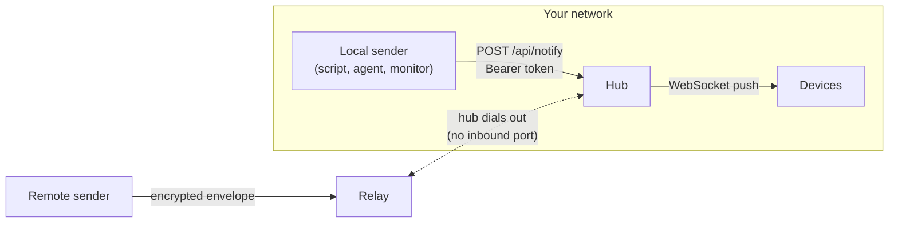
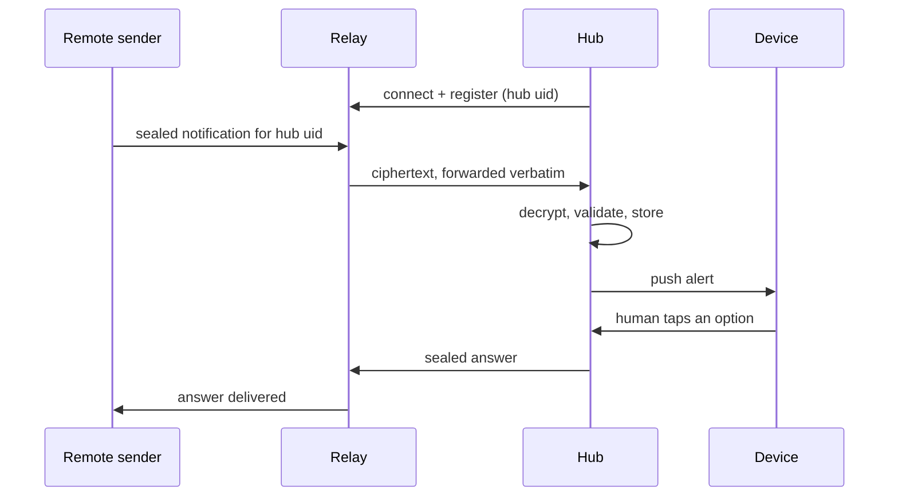

# Architecture overview

Dashboardz has three moving parts — the hub, devices, and senders — plus an
optional relay for senders that have no direct route to the hub. This page
covers how they fit together: who is in charge, how an alert gets from a
sender to a device, and what happens when a human taps a response.

A device shows two kinds of thing, and they arrive by opposite routes.
**Alerts** are pushed in by senders when something happens. **Screens** — the
laid-out widgets a panel displays the rest of the time — are composed in the
hub's admin UI, and the data behind them is fetched by the hub on a schedule
rather than sent to it. Everything below about alerts describes the first
route; [data sources](data.md) describes the second.

## The hub is the single authority

The hub owns the entire alert lifecycle. It deduplicates repeats, expires
alerts that have outlived their usefulness, resolves which devices a
notification actually targets, and keeps the audit trail of what was sent
and when. Nothing else in the system makes decisions: devices just render
what the hub tells them to render, and the relay — when one is in play —
routes bytes it cannot read.

??? note "Technical detail"
    Repeated alerts are collapsed by `dedup_key`: a recurring health check
    sent with the same key updates one existing card instead of growing a
    pile. Expiry is `ttl_s`, enforced hub-side. The full field reference is
    on the [hub page](hub.md).

## Two data paths

An alert reaches the hub one of two ways, depending on whether the sender
can talk to the hub directly or not.

### Direct path

A sender on your network POSTs a JSON body to the hub with a sender token.
The hub validates the token, stores the alert, and pushes it to the
targeted devices over an already-open WebSocket. Every alert carries a
severity, which the device uses to decide how much attention to demand.

??? note "Technical detail"
    The call is `POST /api/notify` with an `Authorization: Bearer` sender
    token, and `severity` is one of `info`, `warn`, or `critical`. The
    [senders page](senders.md) has ready-to-run examples and the full field
    list.

Plain HTTP is for a trusted LAN or private VPN only. If a direct connection
crosses an untrusted or public network, HTTPS through a reverse proxy is
required. Firewall the raw hub port so it is not internet-reachable; proxy
WebSocket upgrades (`Connection: upgrade`, `Upgrade: websocket`) on
`/ws/device`, and set `PUBLIC_URL` to the proxy's `https://` URL. The hub has
no built-in login throttling, so an internet-facing proxy must rate-limit
`/admin/api/login`.

### Relay path

The relay path is for senders that have no route to the hub at all — a
laptop on someone else's network, a job running in the cloud, anything
outside your LAN. Both the hub and the sender dial *out* to the relay;
neither one opens an inbound port, so nothing has to be exposed for either
side to be reachable.

Payloads are sealed sender-to-hub before they ever reach the relay: the
relay just routes ciphertext by the hub's uid and forwards it verbatim, so
it cannot read a title, a body, or an answer. That said, "cannot read
content" is not "learns nothing" — the relay still sees which hub a
message is addressed to, roughly how large it is, and when it arrives, so
don't treat the relay path as anonymous, just as unreadable.

Anyone can run a relay, and SCz Tech operates a hosted one.

## Use cases

*Where the hub runs* and *who operates the relay* are independent choices,
which gives you three setups that cover most situations:

| Setup | You run | Cost | Senders reach you from |
| --- | --- | --- | --- |
| LAN-only | Hub and devices, all local | Free | Your network only |
| Private hub + hosted relay | Hub and devices; SCz Tech runs the relay | Free — sign up | Anywhere |
| Hub on a public VPS | Hub behind an HTTPS reverse proxy on your server | Free | Anywhere, no relay needed |

**LAN-only.** The default. Hub in Docker on any box on your network,
devices paired to it, senders on the same network. Nothing ever leaves
your LAN. *Example: Claude Code finishes a long build on your workstation
and the tablet in the kitchen chimes.*

**Private hub + hosted relay.** Your hub stays unreachable from the
internet; remote senders deliver through the [relay](relay.md), which
routes sealed payloads it cannot read. Free to use — signing up is all it
takes. *Example: a nightly backup job on a rented server alerts the phone
on your nightstand, and your hub never opened a port.*

**Hub on a public VPS.** Same free software, with the hub kept behind an
HTTPS reverse proxy and its raw port firewalled. Senders POST to the proxy
directly and no relay is involved. *Example: a small team runs the hub next
to their other services; the office wall tablet and everyone's scripts talk
to its HTTPS address.*

## Alerts are two-way

A notification isn't necessarily a dead end. It can carry option buttons,
and when a human taps one on a device, that tap travels back to the sender
as an answer. On the direct path the answer is simply recorded hub-side; on
the relay path it is also delivered live to the sender, if the sender is
still connected to wait for it.

??? note "Technical detail"
    Buttons are declared as `options: [{id, label}]` on the notify call —
    between one and four per alert. The tapped option's `id` comes back as
    the answer.

## Devices are stateless

A device keeps no history of its own. Every time it reconnects — after a
reboot, a dropped connection, whatever — it pulls fresh state from the
hub instead of trusting whatever it last had in memory, so a device can
never keep showing something the hub no longer believes to be true. If a
device loses the hub, it shows OFFLINE rather than going quiet or
displaying something stale.
