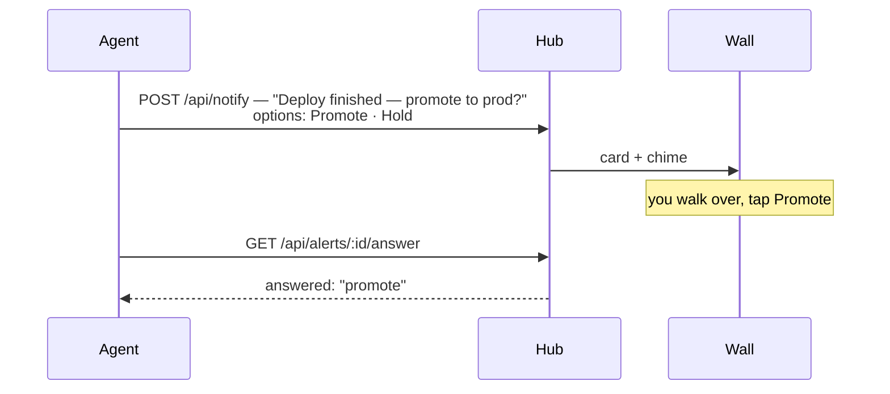

# Claude and AI agents

The strangest integration in the gallery has no process at all. An AI
assistant already speaks HTTP; give it a sender token and a page of
instructions and it *is* the integration — it decides, mid-task, that a
human needs to see something, posts it, and reads back what the human
tapped.

That covers the gap chat pings can't: an agent working while you cook, or
asleep-you two rooms away. The wall wakes, makes noise proportional to how
much it matters, and hands the agent your answer.

## The pieces, smallest first

**The `dashboardz-ask` skill** — one markdown file teaching Claude Code (or
any agent that reads skills) the two HTTP calls, the severity discipline,
and the conduct rules for interrupting a human: when a chime is justified,
when the escalating alarm is, and that a tap on the wall carries the same
weight as a typed answer — report which option was chosen, never stack
questions. Nothing resident runs; the agent calls the hub only when it has
something worth your attention.

**The wall hooks** — the skill covers what the agent *chooses* to say; two
dependency-free shell scripts cover the moment it can't say anything. Wired
to Claude Code's hook system, they post a "needs you · *project*" card the
instant a session blocks on a permission prompt, and retract it the moment
you type back. One card per session however many times it prompts, a TTL so
an abandoned card clears itself — a wall of sessions stays tellable-apart
at a glance.

**The MCP server** — `dashboardz-mcp` is the bigger surface: screens,
feeds, and devices exposed as tools, so an agent doesn't just alert — it
*builds* what it shows on. "Put my CI status on the kitchen tablet" becomes
something the agent does end-to-end: create the feed, design the screen,
assign it, start pushing. It authenticates with an **agent token**, a
separate credential class that can manage screens and feeds but can never
mint or revoke credentials.

**The assistant daemon** — the optional resident half, for the things a
stateless agent can't do: reminders with tap-to-snooze and asks that
escalate if the first chime goes unanswered.

## The pattern it demonstrates

Agents are **first-class operators, not just senders**. The same
security-model line that makes it safe to hand a token to a third-party
box makes it safe to hand one to a model: the token scopes what it can
touch, the hub owns policy, and deleting the sender kills the token and
sweeps its questions off every device instantly.

## Where you could take it

Nothing here is Claude-specific below the skill file. Any agent framework
that can POST JSON — OpenClaw, Hermes, a cron script wrapping an LLM call —
runs the same loop, and anything that reads MCP gets the full
screen-building surface. The interesting frontier is conduct, not
plumbing: the skill's rules about severity and not stacking questions are
what keep an agent with wall access from becoming the noise you installed
this to escape.

## Run it

The [README](https://github.com/rogerio-richa/dashboardz/tree/main/integrations/claude)
covers all four pieces — skill install, hook wiring, MCP config, daemon —
and the [walkthrough](../integrations.md) is the ask/answer loop itself,
runnable from your terminal in step 6.
