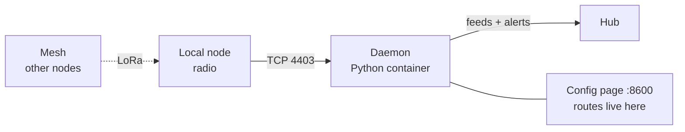

# Meshtastic radios

[Meshtastic](https://meshtastic.org) is an off-grid LoRa mesh: cheap radios
relaying text messages and telemetry over kilometers with no internet and no
infrastructure. Its natural habitat is a phone app you have to remember to
open. This integration puts the mesh on the wall instead — messages appear
as they arrive, the radio's vitals sit in dials, and the one sender you
never want to miss can wake you up.

## What lands on the wall

**Messages, routed like mail.** Every received text is matched against
**routes** you configure: a route is a target feed plus an optional channel
filter, an optional sender filter, and a sound level. The channel picker
offers every channel the radio has — plus **Direct messages**, a
pseudo-channel of its own, because on the air a DM is indistinguishable
from primary-channel chatter and treating it as such would leak private
messages into public feeds. So all of these are one route each:

- everything on LongFast → the main message list, one chime per message
- DMs to this node → their own feed
- anything from one specific person → a dedicated feed with the full
  escalating alarm, whatever channel it arrives on

A message is pushed to every route it matches and beeps once, at the
loudest matched level. Each row carries who sent it, the text, the channel,
and the radio-nerd details: SNR, RSSI, and how many hops it actually took.

**The radio's own health.** Battery (and whether it is on external power),
voltage, channel utilization, transmit air time, and how many nodes the
mesh has heard — polled from the node every few seconds into a value feed,
so the dials are always current instead of waiting for the mesh's
once-in-minutes telemetry broadcast.

## The pattern it demonstrates

This is the **resident daemon** shape: a long-running Python process in one
container, connected to the radio over TCP, reconnecting forever with
backoff. Two decisions worth stealing:

- **It is deliberately not a hub plugin.** The daemon just POSTs to feeds
  with a sender token. A wedged serial link, a protobuf exception, a hung
  socket — none of it can take down the board, because the board never
  runs this code.
- **It owns its own config page.** Channels, node names, and routes are
  Meshtastic vocabulary, so they live on the integration's own tiny web
  page (stdlib HTTP, no JavaScript) — the hub never learns what a channel
  is. That is the boundary that keeps "manage integrations" from becoming
  a plugin framework inside the hub.

## Where you could take it

The daemon already hears **every packet on the mesh**, not just text: it
ignores position, environment, and telemetry packets from other nodes on
purpose. That "on purpose" is one `if` statement — the same loop could
chart a remote solar node's battery, plot GPS positions, or feed a
greenhouse sensor's temperature into a gauge. Anything a Meshtastic node
can measure, a wall can show; the routes model and the push loop are
already there.

## Run it

The [README](https://github.com/rogerio-richa/dashboardz/tree/main/integrations/meshtastic)
has the full setup: one container, an env file with the hub URL and token,
and the config page on port 8600. The general shape — token, feeds, push —
is the [integration walkthrough](../integrations.md).
