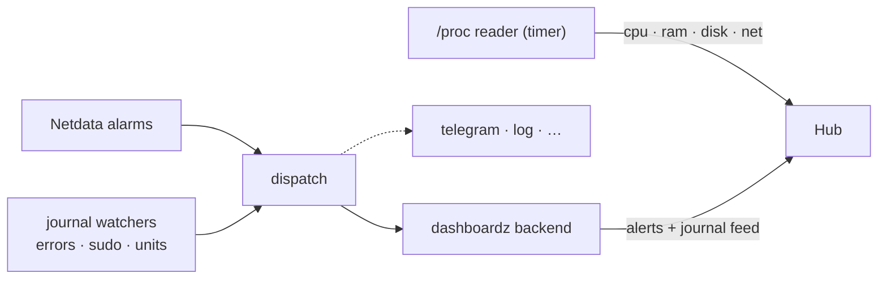

# Netdata fleet health

You have a VM — or nine — and their problems live in a terminal nobody has
open. [Netdata](https://www.netdata.cloud) already watches them; this
integration walks its alarms, plus the host's own vitals and security
journal, onto the wall. It is shell and `curl` all the way down: no
dependencies, no daemon of ours, five minutes per host.

## What lands on the wall

**Alarm cards that clean up after themselves.** RAM pressure, swap, OOM
kills, failed systemd units — each Netdata alarm becomes a card, `warn` or
`critical` by alarm status, and the CLEAR retracts it. A `dedup_key` per
host+alarm means a flapping alarm updates one card instead of papering the
wall.

**Honest gauges.** CPU, RAM, root disk, and network throughput every ~15
seconds — read from `/proc` directly, not Netdata's API, so the dials
survive Netdata being down. The feeds carry `stale_after_s`: a host that
stops pushing *shows* stale instead of lying with old numbers. That, not a
failed unit, is the designed failure signal.

**A security narrative.** Journal errors, every `sudo` invocation, watched
units starting and stopping, and a watchdog that goes CRITICAL when a
critical service leaves `active` — one scrolling stream per host, the
ops story readable at a glance.

## The pattern it demonstrates

This is the **bolt-onto-what-you-run** shape, and its load-bearing wall is
the **dispatch seam**: producers call `netdata-dispatch.sh --key value…`,
which hands one normalized event to a backend script. Dashboardz is just
one backend — adding Telegram, a log file, or the next thing is a new file
in `backends/`, not an edit to anything. A `fanout` backend runs several at
once, each opting out of CLEAR noise individually.

The other rule is **fail soft, always**: every push exits 0 no matter
what. A hub outage must not look like a monitoring failure, and a missed
15-second push must not page anyone — staleness on the wall is the honest
signal, and it is already there.

Hosts with no route to the hub use the same scripts over the
[relay](../architecture/relay.md), sealed end-to-end, by changing two lines
in the env file.

## Where you could take it

The dispatch seam doesn't care that Netdata is upstream. Anything that can
run a shell script with `--key value` arguments — cron jobs, backup
scripts, a smartctl check, CI — can feed the same pipeline and inherit the
dedup, resolve, and fan-out behavior for free. And the `/proc` reader is
forty lines of shell: point the same idea at a Raspberry Pi, a NAS, or
anything with a `/proc` and it becomes a tile on the wall.

## Run it

The [README](https://github.com/rogerio-richa/dashboardz/tree/main/integrations/netdata)
has the five-minute install: `install.sh`, fill one env file, send a smoke
alarm, `enable.sh`. Feed and sender creation is steps 1–2 of the
[walkthrough](../integrations.md).
