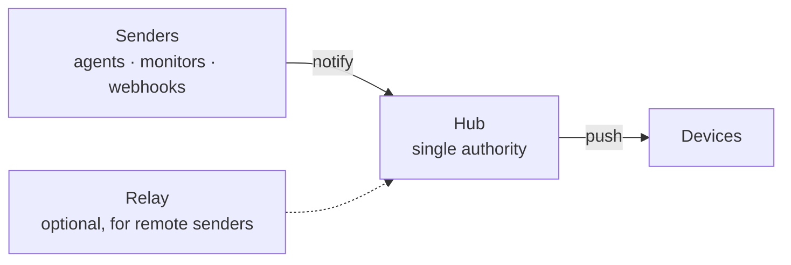

# Dashboardz

Dashboardz turns old phones, tablets, and spare screens into notification
displays for AI agents (Claude Code, Claude Cowork, OpenClaw, Hermes) and
systems (Netdata, Uptime Kuma, Meshtastic, email, any webhook). It shows the
alert, wakes the screen, and makes noise if it's important — like a printer,
but for questions and alerts.

New here? Follow [Getting started](getting-started.md) to run the hub, pair a
browser, and send a test alert in a few minutes. For source work, start with
[Development](development.md).

**In:** a notification (`POST /api/notify`). **On screen:** display, wake,
sound. **Out:** the human noticed it.

## Why not just ping a chat app?

Chat pings drown in noise and die under Do Not Disturb. Dashboardz's promises:
one attention queue for every agent and system, alerts never leave your network
(unless you opt into a relay), it will actually wake you, and it fails loudly —
a device that loses the hub shows OFFLINE, never silence.

## Current use cases

- **LAN-only alerts:** run the hub and devices on one trusted network; nothing
  leaves that network.
- **Remote senders:** keep the hub private and use the optional hosted relay,
  or run a relay yourself.
- **Public self-hosting:** run the hub on a VPS behind an HTTPS reverse proxy
  and let reachable senders post directly.

All three use the same hub and pairing flow. See [Remote access](remote-access.md)
for the privacy and connectivity trade-offs.

Plain HTTP is for a trusted LAN or private VPN only. If any connection
crosses an untrusted or public network, put HTTPS in front of the hub with a
reverse proxy, firewall the raw hub port so it is not internet-reachable,
forward WebSocket upgrades (`Connection: upgrade`, `Upgrade: websocket`) on
`/ws/device`, and set `PUBLIC_URL` to the proxy's `https://` URL. The hub has
no built-in login throttling; an internet-facing proxy must rate-limit
`/admin/api/login`.

## The pieces

Five moving parts, and how they fit together: the [architecture
overview](architecture/overview.md) walks through who decides what, how an
alert reaches a device, and what a relay is for.

- **[Hub](architecture/hub.md)** — the single server that receives alerts and
  pushes them to every paired device. Owns the alert lifecycle.
- **[Devices](architecture/devices.md)** — the Android kiosk app or a browser
  tab. A device can hold several screens as tabs, each with a live status dot.
- **[Senders](architecture/senders.md)** — anything that can POST JSON, plus
  a reference client and CLI for the relay path.
- **[Relay](architecture/relay.md)** — an optional switchboard so senders
  with no route to your hub can still reach it. It cannot read what it
  carries.
- **[Data sources](architecture/data.md)** — what keeps a screen's widgets
  fed between alerts. The hub polls weather, news and calendar providers on a
  schedule; widgets declare what they need and providers declare what they
  offer, and the hub matches them. Also the page to read before writing a
  provider, or before backing up a hub that stores source credentials.

## See it running

The [integration gallery](gallery/index.md) shows what's already on our own
walls — an off-grid [Meshtastic mesh](gallery/meshtastic.md) with private
messages routed apart from public channels, [Claude asking
questions](gallery/claude.md) you answer by tapping the screen, and a
fleet's [health and security journal](gallery/netdata.md) via Netdata —
each with the pattern to steal for your own integration.

## For AI agents

Assistants are first-class operators, not just senders. The admin can mint
[agent tokens](architecture/security.md#agent-tokens) — a separate credential
class that can manage screens, feeds, and tabs but can never mint or revoke
credentials — and the `dashboardz-mcp` server (`clients/mcp`) exposes the hub
to any MCP-speaking assistant, with tool schemas generated from the same
widget contract the hub enforces. An agent can also ask a question on the
wall (an alert with options) and get the human's tap back.

Wondering how this stacks up against MagicMirror², DAKboard, Home Assistant,
or TRMNL? See the honest [comparison](comparison.md).

## Licensing

The repository default is GNU AGPL-3.0, covering the root project, hub
(including `hub/admin`), relay, and components without their own license file.
The explicit MIT exceptions are `clients/sender`, `clients/mcp`,
`integrations/claude/assistant`, and `apps/android`; each has a local
`LICENSE` file. The relay is AGPL-3.0 whether you run your own or use the
hosted instance operated by SCz Tech.
